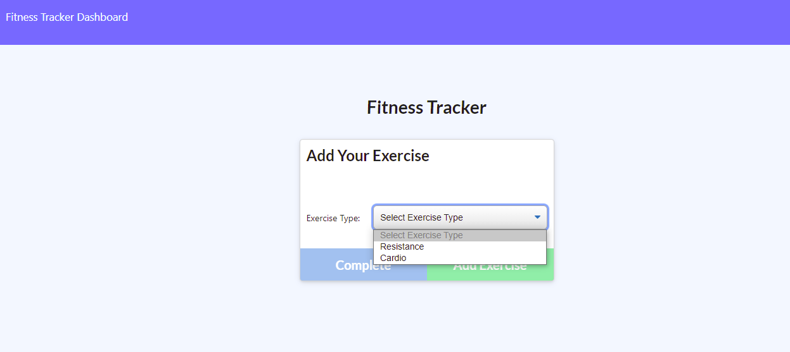
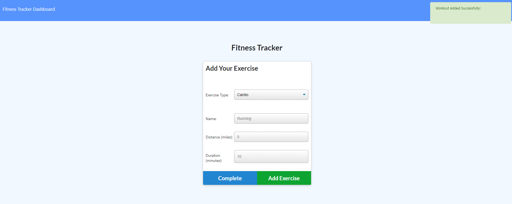

# Fitness-Tracker

 ## Table of Contents
  * [Description](#Description)
  * [Installation](#Installation)
  * [Usage](#Usage)
  * [License](#License)

## Description
This application grants the user to be able to view create and track daily workouts. The user can log multiple exercises in a workout on a given day. Also, be able to track the name, type, weight, sets, reps, and duration of exercises. The exercises are broken down into two categories: cardio or resistance. 

## Installation
To install this application the user will need to install Node.js and MongoDb-Atlas, then initialize the folder containing the application by typing `npm init -y` and `npm i` in the command line to install required dependencies such as express, mongoose, morgan mentioned in the `package.json` file that holds various metadata that's relevant to the project. Installing those modules will produce the node_modules folder that is like a cache for the external modules and Nodejs is trained to look for them there. 

## Usage 

The app is deployed on Heroku platform. [OPEN Fitness-Tracker](https://cryptic-springs-92116.herokuapp.com/)
 
After opening the link, the user will have at their will the fitness tracker, asking them to enter new exercise.  
 

 

 
The user must add an exercise to  start,  selecting from the two exercise types: Resistance or Cardio.
  

 

 
Next, the user must input the specific workout plan according to the type of exercise. In this example, the user will be doing 'Resistance' workout type in which they will be doing bench-pressing 200lbs. in a 4(sets)X10(reps) for a duration of 10 minutes.
  

 

Once the user tracks the specificity of their workout, the will then select the 'add exercise' (green) button,the app will register it and subsequently alert you ont he top right corner. 
 

 

 
Lastly, the user will be able to track via diagrams and line graph of their progression, and weekly routines in the workout dashboard page.
 

 

 

## License

    Permission is hereby granted, free of charge, to any person obtaining a copy of this software and associated documentation files (the "Software"), to deal in the Software without restriction, including without limitation the rights to use, copy, modify, merge, publish, distribute, sublicense, and/or sell copies of the Software, and to permit persons to whom the Software is furnished to do so, subject to the following conditions:
    
    The above copyright notice and this permission notice shall be included in all copies or substantial portions of the Software.
    
    THE SOFTWARE IS PROVIDED "AS IS", WITHOUT WARRANTY OF ANY KIND, EXPRESS OR IMPLIED, INCLUDING BUT NOT LIMITED TO THE WARRANTIES OF MERCHANTABILITY, FITNESS FOR A PARTICULAR PURPOSE AND NONINFRINGEMENT. IN NO EVENT SHALL THE AUTHORS OR COPYRIGHT HOLDERS BE LIABLE FOR ANY CLAIM, DAMAGES OR OTHER LIABILITY, WHETHER IN AN ACTION OF CONTRACT, TORT OR OTHERWISE, ARISING FROM, OUT OF OR IN CONNECTION WITH THE SOFTWARE OR THE USE OR OTHER DEALINGS IN THE SOFTWARE.
    
